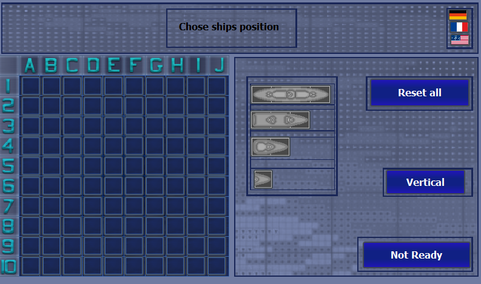
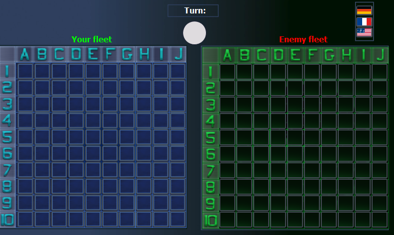
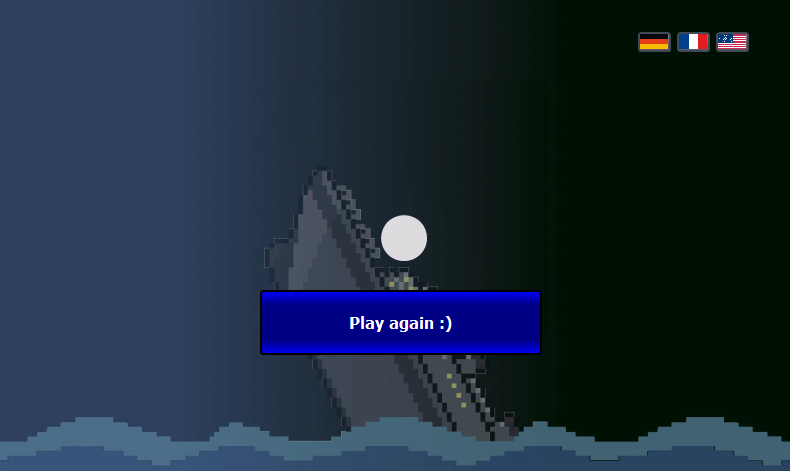

# 🎮 PLC-War-Ships 🚢

## Description 📜

This project is an implementation of popular Battleship game on a PLC controller.  
The project was created in TIA Portal using `LD` and `ST` languages.  

## Hardware ⚙️

* PLC Siemens s7-1214 DC/DC/DC
* 2 x Siemens HMI Panel 7'' (one panel can be simulate)

## Gallery 📷

  

  

  

## Graphics used in project 🎨

[Naval Battle Assets Pack](https://opengameart.org/content/naval-battle-assets-pack) - [Cougarmint](https://opengameart.org/users/cougarmint)

## Contributors 🤝

     

## License 📄

[MIT License](LICENSE)
